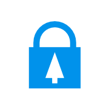

# crypto.christmas 🔒🎄

**_AKA the Twelve Days of Crypto._**

Spend five minutes per day for 12 days to improve your online privacy and security.

This used to live at the domain crypto [dot] christmas but novelty TLDs are expensive!

[It's a website.](https://xmas.rileyjshaw.com)

## News

- crypto.christmas has been [translated to Slovak](https://www.paralelnapoliskosice.sk/rychlokurz-bezpecnosti).
- Brief shout-out in the [CBC's Spark with Nora Young](https://www.cbc.ca/radio/spark/346-biometrics-audio-intelligence-and-more-1.3987746/outwitting-government-and-tech-company-surveillance-through-crypto-parties-1.3987753).
- Covered by [PC Mag](https://uk.pcmag.com/security-9/87090/how-to-fight-the-state-and-stay-secure-while-doing-it).

## License

[Creative Commons Zero 1.0 Universal](./LICENSE)
